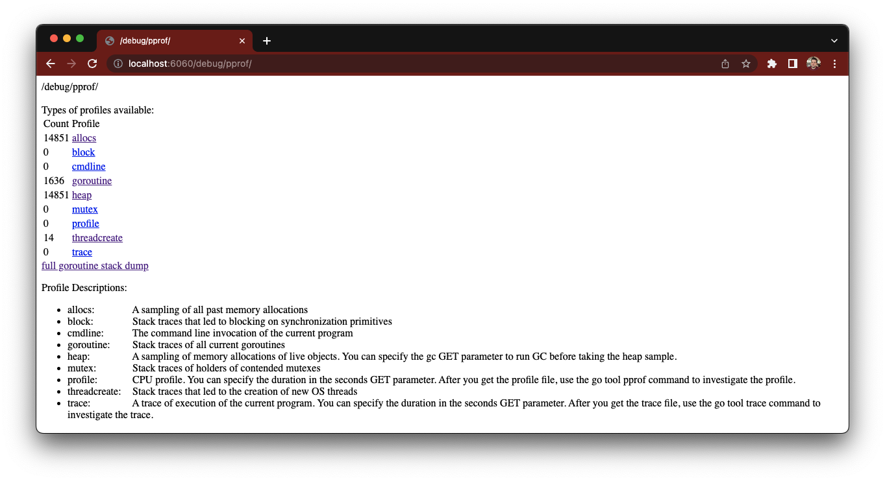

# Development

## Images

## Controller image

The operator controller image lifecycle is managed with the `docker-build` and `docker-push`
targets using the `IMG` and `VERSION` environment variables.

By default, the image is [quay.io/3scale/saas-operator](https://quay.io/3scale/saas-operator) and the version is the one hardcoded in the Makefile, which should be changed for release of new versions.

## Bundle image

The operator bundle image lifecycle is managed with the `bundle-publish` target using the following variables:

* `VERSION`: the version of the olm release. Should always be the same as the operator version.
* `BUNDLE_IMG`: the bundle image for the olm release. Default is `quay.io/3scaleops/go-saas-operator-catalog:$(VERSION)`.
* `CATALOG_IMAGE`: the catalog image. Default is `quay.io/3scaleops/go-saas-operator-catalog:latest`.

## Running the operator

### Running the operator locally against a kubeconfig cluster

```bash
# run the operator watching specific namespace, otherwise will watch all namespaces
make run WATCH_NAMESPACE=example
```

### Running the operator locally against a kind cluster

```bash
# create a kind cluster
make kind-create
# export the kubeconfig
export KUBECONFIG=$PWD/kubeconfig
# install operator CRDs
make install
# install required APIs CRDs
kubectl apply -f config/test/external-apis/
# run the operator
make run
```

### Running the operator inside a kind cluster

You can then run the operator with the following command:

```bash
# build the operator image
make docker-build
# create a kind cluster
make kind-create
# export the kubeconfig
export KUBECONFIG=$PWD/kubeconfig
# install operator CRDs
make kind-deploy
```

## Debugging the operator

In [3scale-ops/saas-operator#180](https://github.com/3scale-ops/saas-operator/pull/180),
the support for `pprof` was added and now can be set by the `PROFILER_*` environment variables.

| Variable              | Format | Default | Information                                    |
| --------------------- | ------ | ------- | ---------------------------------------------- |
| PROFILER_ENABLE       | bool   | false   | Enables or disables the pprof profiler service |
| PROFILER_BIND_ADDRESS | string | 0.0.0.0 | Listen address for the pprof http server       |
| PROFILER_BIND_ORT     | string | 6060    | Listen port for the pprof http server          |

Once the operator is started with the profiler enabled, it can be acccessed on the `:6060` port.
If the operator is running in a remote cluster, use the port forwared kubectl tool:

`oc port-forward $(oc get pods -o name -l  control-plane=controller-manager) 6060:6060`

```
❯ oc port-forward $(oc get pods -o name -l  control-plane=controller-manager) 6060:6060
Forwarding from 127.0.0.1:6060 -> 6060
Forwarding from [::1]:6060 -> 6060
Handling connection for 6060
Handling connection for 6060
Handling connection for 6060

```

Once is up, you can connect to the profile via HTTP: http://localhost:6060/debug/pprof/

[](http://localhost:6060/debug/pprof/)

More information about how to use `pprof` at https://github.com/google/pprof